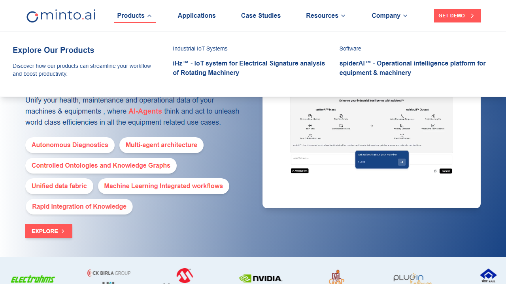
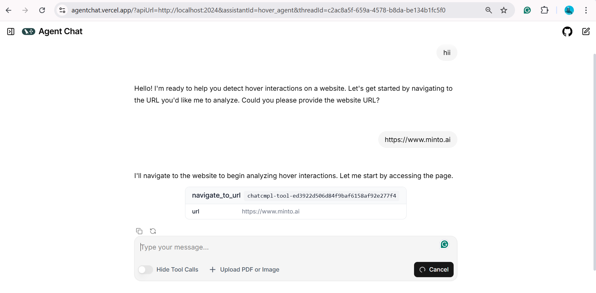
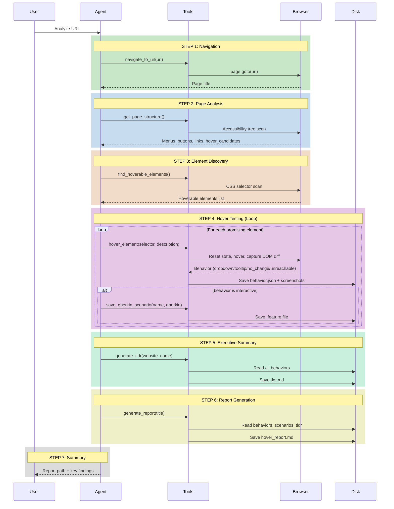
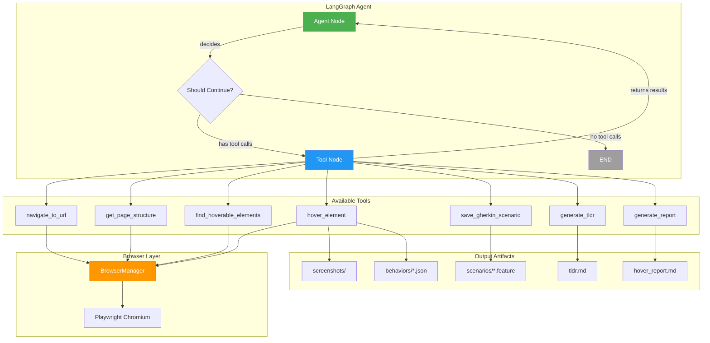

# Hover Detection Agent - Automated BDD Test Generator

An AI-powered agent that automatically detects hover interactions on web applications and generates comprehensive Gherkin test scenarios using the LangGraph agentic framework.

## What You Get

Run the agent on any website and receive a complete test report with:

| Output | Description |
|--------|-------------|
| `hover_report.md` | Full report with screenshots and Gherkin scenarios |
| `tldr.md` | Executive summary for stakeholders |
| `screenshots/` | Before/after hover images as evidence |
| `scenarios/*.feature` | Individual Gherkin test files |
| `behaviors/*.json` | Raw behavior data for analysis |

> **See it in action:** [Example minto.ai report](output/084c8d35-2363-4eef-a411-940479298473/) | [View LangSmith Trace](https://smith.langchain.com/public/c36b3047-4370-4fe2-912e-b48dd91b9938/r)

### Screenshot Evidence

The agent captures before/after screenshots for each hover interaction:

| Before Hover | After Hover (Dropdown Revealed) |
|--------------|--------------------------------|
|  |  |

### Sample TLDR Summary

```markdown
## TLDR - Executive Summary

**Website:** minto.ai
**Test Date:** 2025-12-18 13:00

### At a Glance
| Metric | Value |
|--------|-------|
| Total Elements Tested | 23 |
| Interactive Elements Found | 14 |
| Test Success Rate | 78.3% |
| Gherkin Scenarios Generated | 14 |

### Key Findings
- **Dropdowns Detected (4):** Products, Resources, Company, Contact Us menus
- **Content Revealed (1):** Explore All Applications button
- **Unreachable Elements (5):** Out of viewport or dynamically loaded
```

### Sample Gherkin Scenario

```gherkin
Feature: Hover Interaction - Products Menu
  As a user visiting the website
  I want to see dropdown content when hovering over the Products menu
  So that I can access product categories

  @hover @dropdown
  Scenario: Products menu reveals dropdown on hover
    Given I am on the homepage
    When I hover over the "Products" menu item
    Then a dropdown menu should become visible
    And I should see the following links:
      | Link Text | URL |
      | iHz - IoT system | /ihz |
      | spiderAI - Operational intelligence | /spiderai |
```

---

## Quick Start

```bash
# 1. Clone and setup
cd PlayWriterAutomation
uv sync
uv run playwright install chromium

# 2. Configure LLM (choose one in .env)
# Option A: Custom vLLM endpoint
LLM_BASE_URL=http://your-server:8908/v1
LLM_MODEL_NAME=Qwen/Qwen3-VL-30B-A3B-Instruct-FP8

# Option B: Anthropic
ANTHROPIC_API_KEY=sk-ant-...

# Option C: OpenAI
OPENAI_API_KEY=sk-...

# 3. Start LangGraph server
uv run langgraph dev --port 2024 --allow-blocking

# 4. Access Studio UI
# Open: https://smith.langchain.com/studio/?baseUrl=http://127.0.0.1:2024
```

### Chat Interface

Use [Agent Chat UI](https://github.com/langchain-ai/agent-chat-ui) - LangChain's open-source web app for interacting with any LangGraph agent via a chat interface.

**Try it instantly:** [agentchat.vercel.app](https://agentchat.vercel.app/?apiUrl=http://localhost:2024&assistantId=hover_agent)



**Features:**
- Streaming responses with real-time updates
- Tool call visualization
- Human-in-the-loop interrupts
- Thread management for conversation history
- Works with any LangGraph server

**Alternative:** Run locally with `npx create-agent-chat-app`

### API Endpoints

| Endpoint | Description |
|----------|-------------|
| `http://127.0.0.1:2024/ok` | Health check |
| `http://127.0.0.1:2024/docs` | API documentation |
| [Agent Chat UI](https://agentchat.vercel.app/?apiUrl=http://localhost:2024&assistantId=hover_agent) | Chat interface |
| [LangSmith Studio](https://smith.langchain.com/studio/?baseUrl=http://127.0.0.1:2024) | Visual debugging UI |

---

## How It Works

### Objective

**Automatically test and document all hover events in a web application by:**

1. Navigating to any given URL
2. Detecting all hoverable elements (menus, buttons, cards, etc.)
3. Testing each element's hover behavior
4. Capturing before/after screenshots as evidence
5. Generating Gherkin BDD scenarios for interactive elements
6. Producing a comprehensive markdown report with executive summary

### Behavior Classification

| Behavior | Description | Gherkin Generated? |
|----------|-------------|-------------------|
| `dropdown` | Menu/submenu appears with links | Yes |
| `tooltip` | Tooltip or popover appears | Yes |
| `content_revealed` | New content becomes visible | Yes |
| `no_change` | No DOM changes detected | No (TLDR only) |
| `unreachable` | Element out of viewport/hidden | No (TLDR only) |

### Agent Workflow

The agent follows a structured 7-step workflow:



---

## Architecture

**Agent-Driven Playwright Orchestration** using the LangGraph Agentic Framework to automate, test multiple scenarios, and create comprehensive reports.

| Component | Technology | Purpose |
|-----------|------------|---------|
| **Agent Framework** | LangGraph | Orchestrates tool calls, manages state, handles workflow |
| **Browser Automation** | Playwright (Sync API) | Persistent browser session for DOM interaction |
| **LLM Backend** | Configurable (Claude/GPT/Custom) | Decision making and Gherkin generation |
| **Report Generation** | Markdown + Screenshots | Documentation with visual evidence |

### Why This Architecture?

| Challenge | Solution |
|-----------|----------|
| Browser session persistence | Custom BrowserManager with ThreadPoolExecutor |
| Windows asyncio conflicts | Sync Playwright API wrapped for async access |
| LLM state management | Disk-based behavior persistence (not LLM memory) |
| Stakeholder-friendly reports | TLDR summaries + detailed Gherkin scenarios |

### System Diagram



---

## Configuration

### Project Structure

```
PlayWriterAutomation/
├── src/
│   ├── __init__.py
│   ├── agent.py          # LangGraph agent definition + workflow
│   ├── browser.py        # Playwright session management
│   └── tools.py          # LangChain tools for hover detection
├── docs/
│   └── images/           # README screenshots and diagrams
├── tests/                # Unit tests
├── output/               # Generated artifacts (per session)
│   └── {session-id}/
│       ├── hover_report.md
│       ├── tldr.md
│       ├── screenshots/
│       ├── scenarios/
│       └── behaviors/
├── archived/             # Old/experimental code
├── langgraph.json        # LangGraph configuration
├── pyproject.toml        # Dependencies
└── README.md
```

### langgraph.json

```json
{
  "graphs": {
    "hover_agent": "src.agent:graph"
  },
  "env": ".env"
}
```

### Environment Variables

| Variable | Description | Default |
|----------|-------------|---------|
| `LLM_BASE_URL` | Custom LLM endpoint | - |
| `LLM_MODEL_NAME` | Model name for custom endpoint | Qwen/Qwen3-VL-30B |
| `ANTHROPIC_API_KEY` | Anthropic API key | - |
| `OPENAI_API_KEY` | OpenAI API key | - |

### Development

```bash
# Run tests
uv run pytest -v

# Add dependency
uv add <package>

# Check server logs
# Logs appear in terminal running langgraph dev
```

---

## Observability

**Full observability powered by [LangSmith](https://smith.langchain.com/)** - Every agent run is automatically traced, providing complete visibility into:

- LLM calls and token usage
- Tool invocations and results
- Agent decision flow
- Execution timing and performance

### Example Trace

View a complete trace of the agent analyzing [minto.ai](https://minto.ai):

**[View Live Trace on LangSmith](https://smith.langchain.com/public/c36b3047-4370-4fe2-912e-b48dd91b9938/r)**

This trace shows the full agent workflow: navigation, page analysis, hover detection, Gherkin generation, and report creation.

---

## Evaluation

> **Note:** Automated evaluation pipeline is planned for future development.

### Evaluation Metrics

#### 1. Generation Metrics

| Metric | Description |
|--------|-------------|
| **Time to Generate** | Total seconds from URL input to Gherkin output |
| **Tokens Used** | LLM tokens consumed (input + output) |

#### 2. Gherkin Quality Metrics

| Metric | Description |
|--------|-------------|
| **Syntax Valid** | Pass/Fail — Does it parse correctly? |
| **Scenario Count** | Number of test scenarios generated |

#### 3. Website/Playwright Metrics

| Metric | Description |
|--------|-------------|
| **Hover Elements Found** | Count of hoverable elements detected |
| **DOM Changes Detected** | Count of elements that triggered visible changes on hover |

### Example Evaluation: minto.ai

```
URL: https://minto.ai

Generation:
  - Time: 468 seconds
  - Tokens: 630,000 (input + output)

Gherkin:
  - Syntax Valid: ✓
  - Scenarios Generated: 14

Website:
  - Hover Elements Found: 23
  - DOM Changes Detected: 14
```

---

## Technologies

| Technology | Purpose |
|------------|---------|
| **Python 3.11+** | Core runtime |
| **LangGraph** | Agentic workflow orchestration |
| **LangChain** | LLM integration and tool framework |
| **Playwright** | Browser automation (Chromium) |
| **LangSmith** | Observability and tracing |
| **[Agent Chat UI](https://github.com/langchain-ai/agent-chat-ui)** | Web chat interface for LangGraph agents |
| **vLLM** | Self-hosted LLM inference server |
| **Qwen3-VL-30B** | Vision-language model for decision making |
| **Pydantic** | Data validation and settings |

## License

MIT
