# Hover Detection Report for minto.ai

Generated: 2025-12-18 13:48:41
Session ID: `084c8d35-2363-4eef-a411-940479298473`

---

## TLDR - Executive Summary

**Website:** minto.ai
**Test Date:** 2025-12-18 13:48
**Session ID:** `084c8d35-2363-4eef-a411-940479298473`

### At a Glance

| Metric | Value |
|--------|-------|
| Total Elements Tested | 23 |
| Interactive Elements Found | 14 |
| Test Success Rate | 78.3% |
| Gherkin Scenarios Generated | 14 |

### Key Findings

**✅ Dropdowns Detected (13):**
  - **Products menu item**: reveals 2 links
  - **Resources menu item**: reveals 4 links
  - **Company menu item**: reveals 4 links
  - **Contact Us button**: reveals 6 links
  - **Home link**: reveals 10 links

**✅ Content Revealed on Hover (1):** Elements that show additional content on hover

**ℹ️ Static Elements (4):** Elements with no hover behavior (click-only)

**ℹ️ Unreachable Elements (5):** Elements that could not be hovered (out of viewport, hidden, or dynamically loaded)
  - GET DEMO button
  - spiderAI™ product card
  - iHz™ product card
  - ... and 2 more

### Insights

- The site has **14 interactive hover elements** that enhance user navigation
- Dropdown menus reveal a total of **102 navigation links**
- **5 elements** were unreachable (out of viewport, hidden, or dynamically loaded - this is expected for modern dynamic websites)
- **Moderate test coverage** - some elements had interaction issues

---

## Table of Contents

1. [TLDR - Executive Summary](#tldr---executive-summary)
2. [Test Scenarios with Evidence](#test-scenarios-with-evidence)
3. [Summary](#summary)

---

## Test Scenarios with Evidence

Each scenario includes the Gherkin specification followed by before/after screenshot comparison.

### About Link

**Behavior Detected:** `dropdown`
**Scenario File:** `scenarios/About_Link.feature`

```gherkin
Feature: Hover Interaction - About Link
  As a user visiting the website
  I want to see dropdown content when hovering over the About link
  So that I can access navigation links

  @hover @dropdown
  Scenario: About link reveals dropdown on hover
    Given I am on the homepage
    When I hover over the "About" link
    Then a dropdown menu should become visible
    And I should see the following links:
      | Link Text | URL |
      | Home | / |
      | spiderAI™ | /spiderai |
      | iHz™ | /ihz |
      | About | /about |
      | Blog | /blog |
      | Contact Us | /contactus |
      | Facebook | https://www.facebook.com/profile.php?id=100042907616152 |
      | Instagram | https://www.instagram.com/inside_minto.ai/ |
      | Twitter | https://x.com/mintoai_iiot?lang=en |
      | LinkedIn | https://in.linkedin.com/company/mintoai |
```

#### Screenshot Evidence

| Before Hover | After Hover |
|:------------:|:-----------:|
| 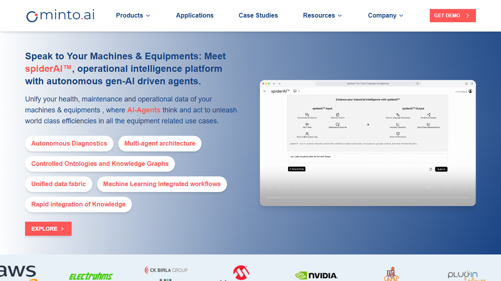 |  |

#### Revealed Links

- [Home](/)
- [spiderAI™](/spiderai)
- [iHz™](/ihz)
- [About](/about)
- [Blog](/blog)

---

### Blog Link

**Behavior Detected:** `dropdown`
**Scenario File:** `scenarios/Blog_Link.feature`

```gherkin
Feature: Hover Interaction - Blog Link
  As a user visiting the website
  I want to see dropdown content when hovering over the Blog link
  So that I can access navigation links

  @hover @dropdown
  Scenario: Blog link reveals dropdown on hover
    Given I am on the homepage
    When I hover over the "Blog" link
    Then a dropdown menu should become visible
    And I should see the following links:
      | Link Text | URL |
      | Home | / |
      | spiderAI™ | /spiderai |
      | iHz™ | /ihz |
      | About | /about |
      | Blog | /blog |
      | Contact Us | /contactus |
      | Facebook | https://www.facebook.com/profile.php?id=100042907616152 |
      | Instagram | https://www.instagram.com/inside_minto.ai/ |
      | Twitter | https://x.com/mintoai_iiot?lang=en |
      | LinkedIn | https://in.linkedin.com/company/mintoai |
```

#### Screenshot Evidence

| Before Hover | After Hover |
|:------------:|:-----------:|
| 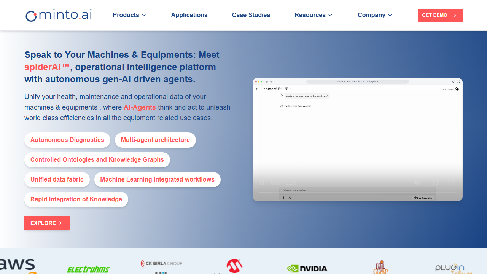 |  |

#### Revealed Links

- [Home](/)
- [spiderAI™](/spiderai)
- [iHz™](/ihz)
- [About](/about)
- [Blog](/blog)

---

### Company Menu

**Behavior Detected:** `dropdown`
**Scenario File:** `scenarios/Company_Menu.feature`

```gherkin
Feature: Hover Interaction - Company Menu
  As a user visiting the website
  I want to see dropdown content when hovering over the Company menu
  So that I can access company-related information

  @hover @dropdown
  Scenario: Company menu reveals dropdown on hover
    Given I am on the homepage
    When I hover over the "Company" menu item
    Then a dropdown menu should become visible
    And I should see the following links:
      | Link Text | URL |
      | About us | /about |
      | Careers | /careers |
      | Contact | /contactus |
      | Looking for a new career? Get in touch | /contactus |
```

#### Screenshot Evidence

| Before Hover | After Hover |
|:------------:|:-----------:|
|  | 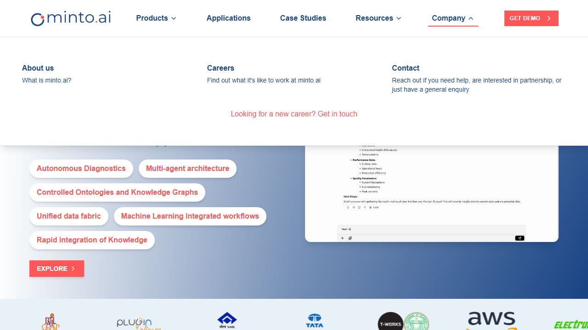 |

#### Revealed Links

- [About us](/about)
- [Careers](/careers)
- [Contact](/contactus)
- [Looking for a new career? Get in touch](/contactus)

---

### Contact Us Button

**Behavior Detected:** `dropdown`
**Scenario File:** `scenarios/Contact_Us_Button.feature`

```gherkin
Feature: Hover Interaction - Contact Us Button
  As a user visiting the website
  I want to see dropdown content when hovering over the Contact Us button
  So that I can access contact information and navigation links

  @hover @dropdown
  Scenario: Contact Us button reveals dropdown on hover
    Given I am on the homepage
    When I hover over the "Contact Us" button
    Then a dropdown menu should become visible
    And I should see the following links:
      | Link Text | URL |
      | Home | / |
      | spiderAI™ | /spiderai |
      | iHz™ | /ihz |
      | Facebook | https://www.facebook.com/profile.php?id=100042907616152 |
      | Instagram | https://www.instagram.com/inside_minto.ai/ |
      | Twitter | https://x.com/mintoai_iiot?lang=en |
```

#### Screenshot Evidence

| Before Hover | After Hover |
|:------------:|:-----------:|
| 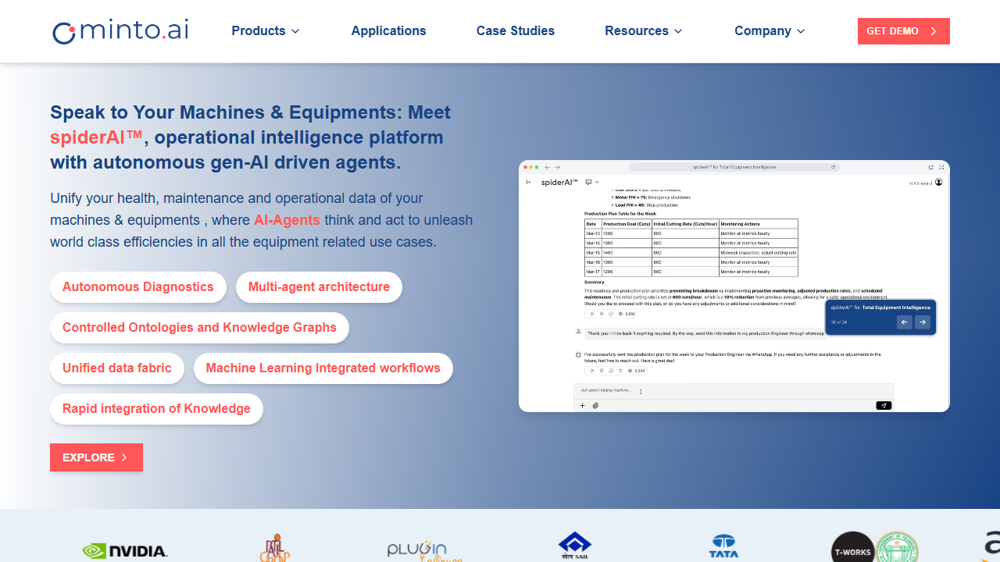 |  |

#### Revealed Links

- [Home](/)
- [spiderAI™](/spiderai)
- [iHz™](/ihz)
- [Facebook](https://www.facebook.com/profile.php?id=100042907616152)
- [Instagram](https://www.instagram.com/inside_minto.ai/)

---

### Contact Us Link

**Behavior Detected:** `dropdown`
**Scenario File:** `scenarios/Contact_Us_Link.feature`

```gherkin
Feature: Hover Interaction - Contact Us Link
  As a user visiting the website
  I want to see dropdown content when hovering over the Contact Us link
  So that I can access contact information and navigation links

  @hover @dropdown
  Scenario: Contact Us link reveals dropdown on hover
    Given I am on the homepage
    When I hover over the "Contact Us" link
    Then a dropdown menu should become visible
    And I should see the following links:
      | Link Text | URL |
      | Home | / |
      | spiderAI™ | /spiderai |
      | iHz™ | /ihz |
      | Facebook | https://www.facebook.com/profile.php?id=100042907616152 |
      | Instagram | https://www.instagram.com/inside_minto.ai/ |
      | Twitter | https://x.com/mintoai_iiot?lang=en |
```

#### Screenshot Evidence

| Before Hover | After Hover |
|:------------:|:-----------:|
| 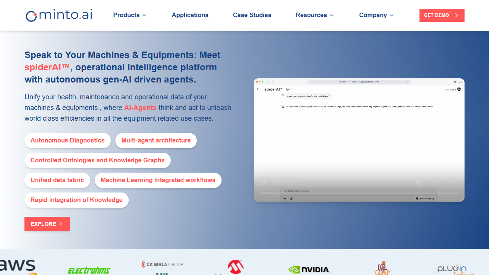 | 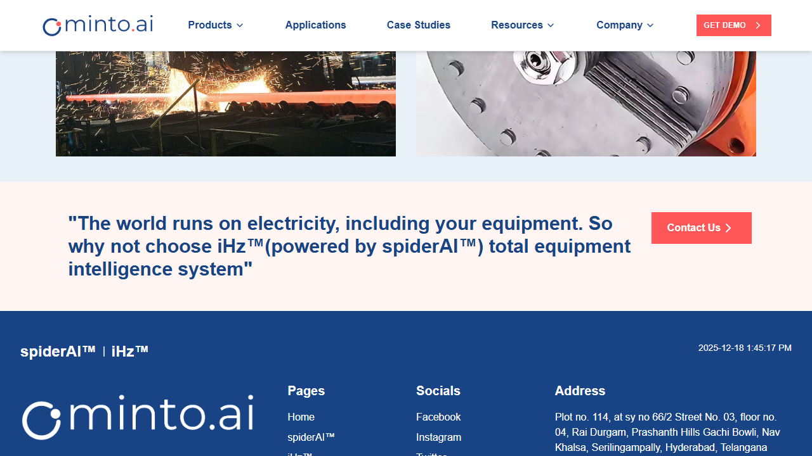 |

#### Revealed Links

- [Home](/)
- [spiderAI™](/spiderai)
- [iHz™](/ihz)
- [Facebook](https://www.facebook.com/profile.php?id=100042907616152)
- [Instagram](https://www.instagram.com/inside_minto.ai/)

---

### Explore All Applications Button

**Behavior Detected:** `content_revealed`
**Scenario File:** `scenarios/Explore_All_Applications_Button.feature`

```gherkin
Feature: Hover Interaction - Explore All Applications Button
  As a user visiting the website
  I want to see additional content when hovering over the Explore All Applications button
  So that I can access more application options

  @hover @content_revealed
  Scenario: Explore All Applications button reveals additional content on hover
    Given I am on the homepage
    When I hover over the "Explore All Applications" button
    Then additional content should become visible
    And I should see the following elements:
      | Element Type | Description |
      | BUTTON | Additional application buttons |
```

#### Screenshot Evidence

| Before Hover | After Hover |
|:------------:|:-----------:|
| 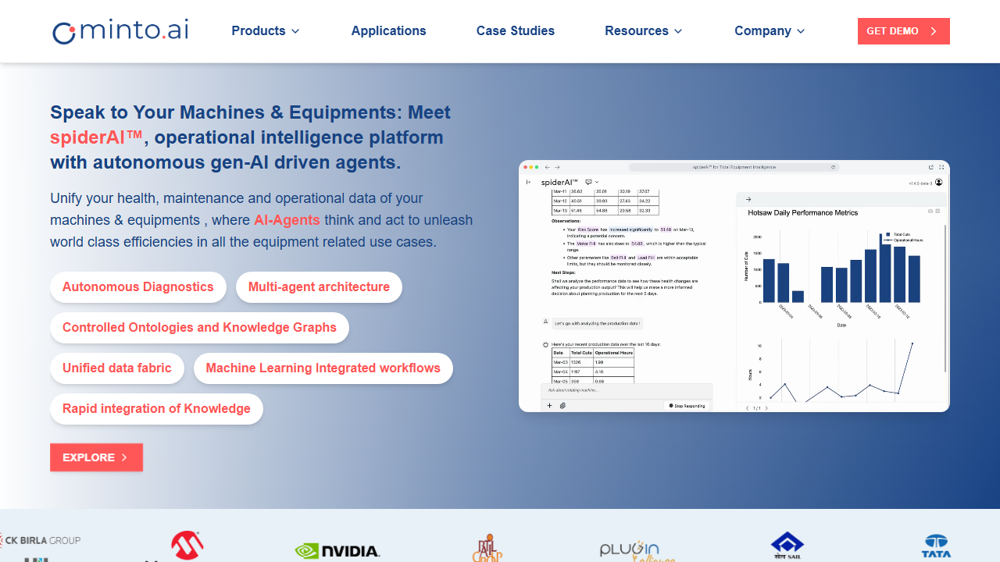 | 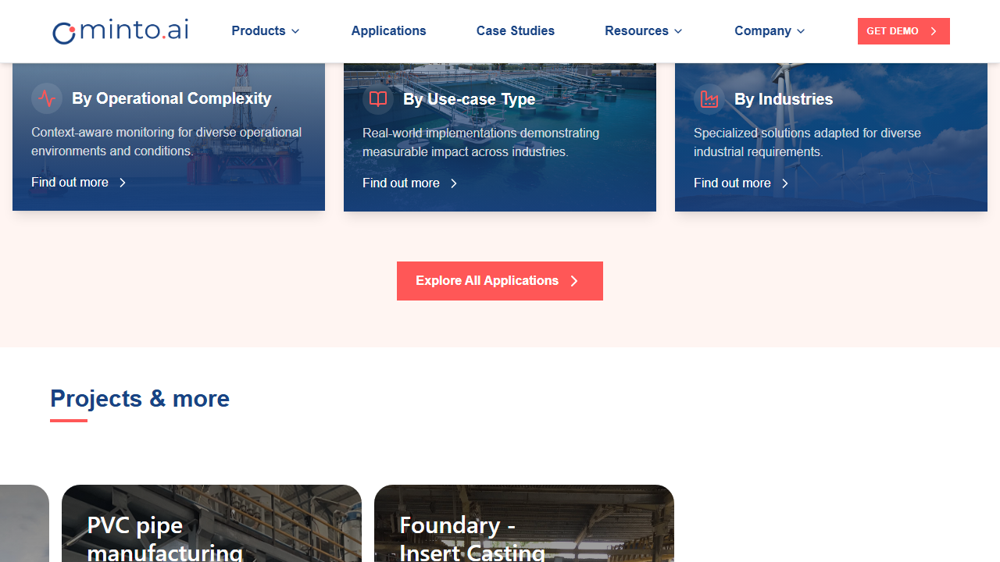 |

---

### Facebook Link

**Behavior Detected:** `dropdown`
**Scenario File:** `scenarios/Facebook_Link.feature`

```gherkin
Feature: Hover Interaction - Facebook Link
  As a user visiting the website
  I want to see dropdown content when hovering over the Facebook link
  So that I can access navigation links

  @hover @dropdown
  Scenario: Facebook link reveals dropdown on hover
    Given I am on the homepage
    When I hover over the "Facebook" link
    Then a dropdown menu should become visible
    And I should see the following links:
      | Link Text | URL |
      | Home | / |
      | spiderAI™ | /spiderai |
      | iHz™ | /ihz |
      | About | /about |
      | Blog | /blog |
      | Contact Us | /contactus |
      | Facebook | https://www.facebook.com/profile.php?id=100042907616152 |
      | Instagram | https://www.instagram.com/inside_minto.ai/ |
      | Twitter | https://x.com/mintoai_iiot?lang=en |
      | LinkedIn | https://in.linkedin.com/company/mintoai |
```

#### Screenshot Evidence

| Before Hover | After Hover |
|:------------:|:-----------:|
|  | 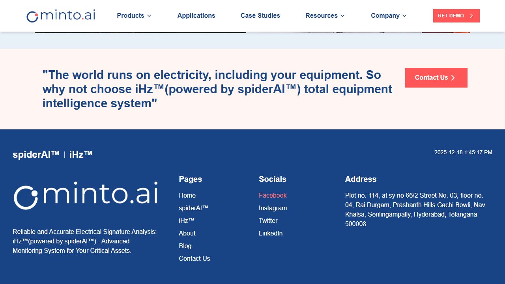 |

#### Revealed Links

- [Home](/)
- [spiderAI™](/spiderai)
- [iHz™](/ihz)
- [About](/about)
- [Blog](/blog)

---

### Home Link

**Behavior Detected:** `dropdown`
**Scenario File:** `scenarios/Home_Link.feature`

```gherkin
Feature: Hover Interaction - Home Link
  As a user visiting the website
  I want to see dropdown content when hovering over the Home link
  So that I can access navigation links

  @hover @dropdown
  Scenario: Home link reveals dropdown on hover
    Given I am on the homepage
    When I hover over the "Home" link
    Then a dropdown menu should become visible
    And I should see the following links:
      | Link Text | URL |
      | Home | / |
      | spiderAI™ | /spiderai |
      | iHz™ | /ihz |
      | About | /about |
      | Blog | /blog |
      | Contact Us | /contactus |
      | Facebook | https://www.facebook.com/profile.php?id=100042907616152 |
      | Instagram | https://www.instagram.com/inside_minto.ai/ |
      | Twitter | https://x.com/mintoai_iiot?lang=en |
      | LinkedIn | https://in.linkedin.com/company/mintoai |
```

#### Screenshot Evidence

| Before Hover | After Hover |
|:------------:|:-----------:|
| 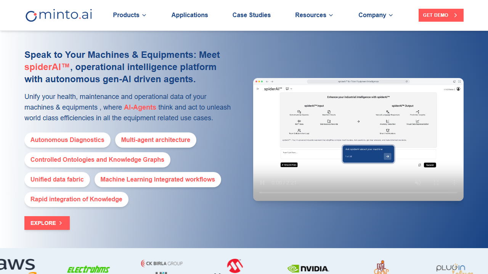 |  |

#### Revealed Links

- [Home](/)
- [spiderAI™](/spiderai)
- [iHz™](/ihz)
- [About](/about)
- [Blog](/blog)

---

### iHz  Link

**Behavior Detected:** `dropdown`
**Scenario File:** `scenarios/iHz__Link.feature`

```gherkin
Feature: Hover Interaction - iHz™ Link
  As a user visiting the website
  I want to see dropdown content when hovering over the iHz™ link
  So that I can access navigation links

  @hover @dropdown
  Scenario: iHz™ link reveals dropdown on hover
    Given I am on the homepage
    When I hover over the "iHz™" link
    Then a dropdown menu should become visible
    And I should see the following links:
      | Link Text | URL |
      | Home | / |
      | spiderAI™ | /spiderai |
      | iHz™ | /ihz |
      | About | /about |
      | Blog | /blog |
      | Contact Us | /contactus |
      | Facebook | https://www.facebook.com/profile.php?id=100042907616152 |
      | Instagram | https://www.instagram.com/inside_minto.ai/ |
      | Twitter | https://x.com/mintoai_iiot?lang=en |
      | LinkedIn | https://in.linkedin.com/company/mintoai |
```

#### Screenshot Evidence

| Before Hover | After Hover |
|:------------:|:-----------:|
| 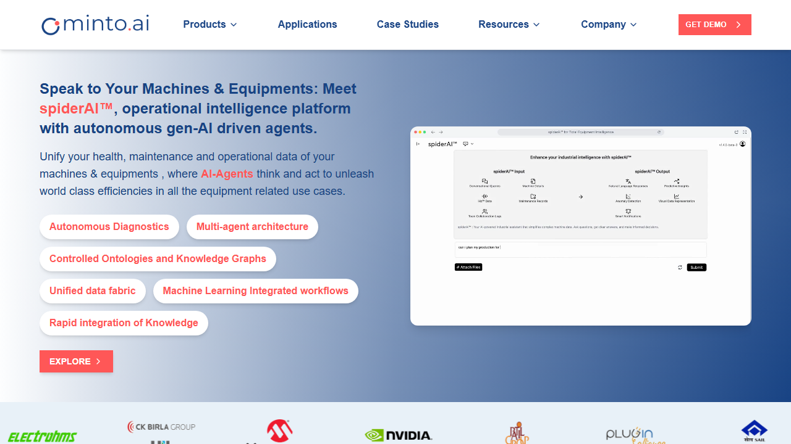 |  |

#### Revealed Links

- [Home](/)
- [spiderAI™](/spiderai)
- [iHz™](/ihz)
- [About](/about)
- [Blog](/blog)

---

### Instagram Link

**Behavior Detected:** `dropdown`
**Scenario File:** `scenarios/Instagram_Link.feature`

```gherkin
Feature: Hover Interaction - Instagram Link
  As a user visiting the website
  I want to see dropdown content when hovering over the Instagram link
  So that I can access navigation links

  @hover @dropdown
  Scenario: Instagram link reveals dropdown on hover
    Given I am on the homepage
    When I hover over the "Instagram" link
    Then a dropdown menu should become visible
    And I should see the following links:
      | Link Text | URL |
      | Home | / |
      | spiderAI™ | /spiderai |
      | iHz™ | /ihz |
      | About | /about |
      | Blog | /blog |
      | Contact Us | /contactus |
      | Facebook | https://www.facebook.com/profile.php?id=100042907616152 |
      | Instagram | https://www.instagram.com/inside_minto.ai/ |
      | Twitter | https://x.com/mintoai_iiot?lang=en |
      | LinkedIn | https://in.linkedin.com/company/mintoai |
```

#### Screenshot Evidence

| Before Hover | After Hover |
|:------------:|:-----------:|
| 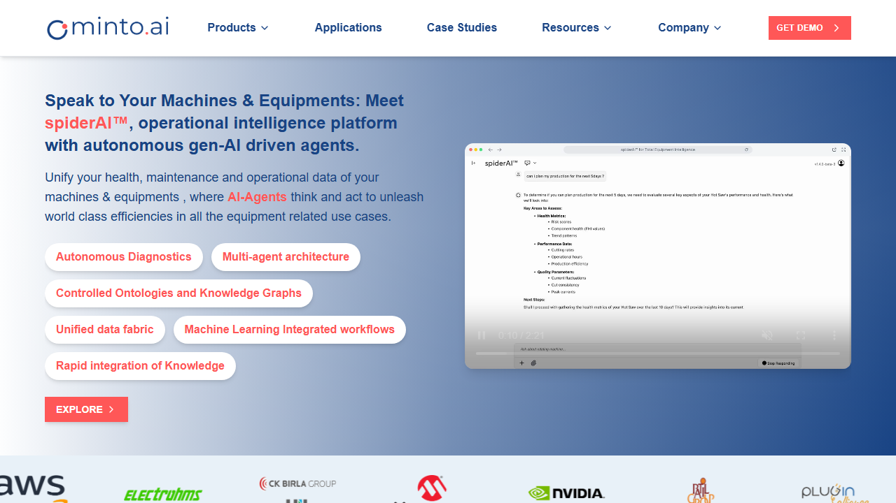 |  |

#### Revealed Links

- [Home](/)
- [spiderAI™](/spiderai)
- [iHz™](/ihz)
- [About](/about)
- [Blog](/blog)

---

### LinkedIn Link

**Behavior Detected:** `dropdown`
**Scenario File:** `scenarios/LinkedIn_Link.feature`

```gherkin
Feature: Hover Interaction - LinkedIn Link
  As a user visiting the website
  I want to see dropdown content when hovering over the LinkedIn link
  So that I can access navigation links

  @hover @dropdown
  Scenario: LinkedIn link reveals dropdown on hover
    Given I am on the homepage
    When I hover over the "LinkedIn" link
    Then a dropdown menu should become visible
    And I should see the following links:
      | Link Text | URL |
      | Home | / |
      | spiderAI™ | /spiderai |
      | iHz™ | /ihz |
      | About | /about |
      | Blog | /blog |
      | Contact Us | /contactus |
      | Facebook | https://www.facebook.com/profile.php?id=100042907616152 |
      | Instagram | https://www.instagram.com/inside_minto.ai/ |
      | Twitter | https://x.com/mintoai_iiot?lang=en |
      | LinkedIn | https://in.linkedin.com/company/mintoai |
```

#### Screenshot Evidence

| Before Hover | After Hover |
|:------------:|:-----------:|
| 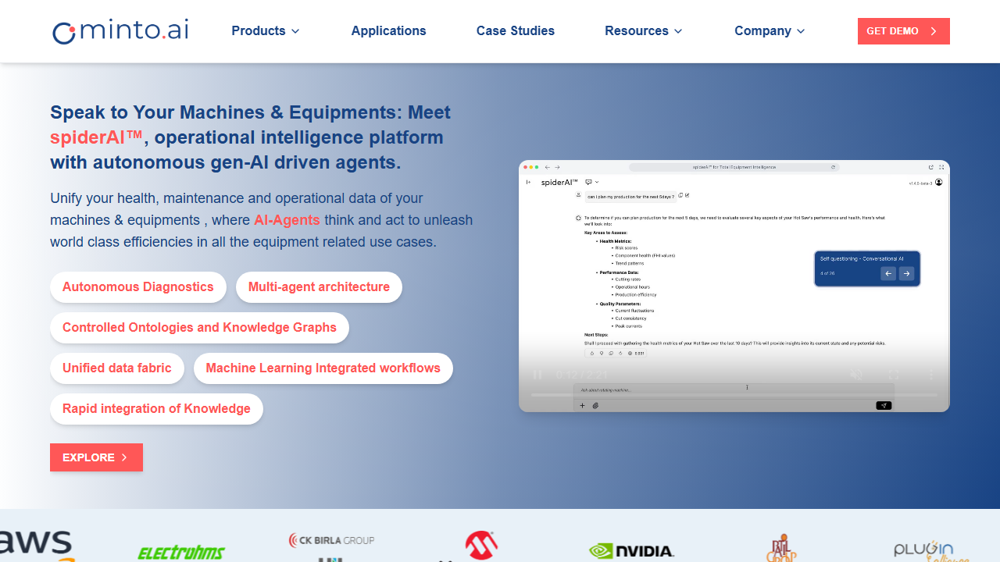 |  |

#### Revealed Links

- [Home](/)
- [spiderAI™](/spiderai)
- [iHz™](/ihz)
- [About](/about)
- [Blog](/blog)

---

### Products Menu

**Behavior Detected:** `dropdown`
**Scenario File:** `scenarios/Products_Menu.feature`

```gherkin
Feature: Hover Interaction - Products Menu
  As a user visiting the website
  I want to see dropdown content when hovering over the Products menu
  So that I can access product categories

  @hover @dropdown
  Scenario: Products menu reveals dropdown on hover
    Given I am on the homepage
    When I hover over the "Products" menu item
    Then a dropdown menu should become visible
    And I should see the following links:
      | Link Text | URL |
      | iHz™ - IoT system for Electrical Signature analysi | /ihz |
      | spiderAI™ - Operational intelligence platform for  | /spiderai |
```

#### Screenshot Evidence

| Before Hover | After Hover |
|:------------:|:-----------:|
| 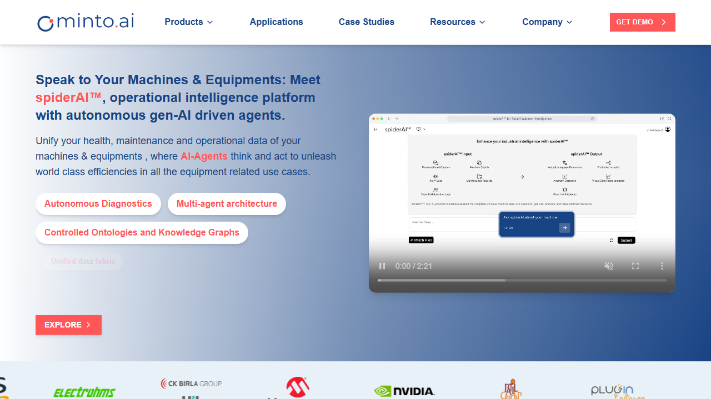 |  |

#### Revealed Links

- [iHz™ - IoT system for Electrical Signature analysi](/ihz)
- [spiderAI™ - Operational intelligence platform for ](/spiderai)

---

### Resources Menu

**Behavior Detected:** `dropdown`
**Scenario File:** `scenarios/Resources_Menu.feature`

```gherkin
Feature: Hover Interaction - Resources Menu
  As a user visiting the website
  I want to see dropdown content when hovering over the Resources menu
  So that I can access various resources

  @hover @dropdown
  Scenario: Resources menu reveals dropdown on hover
    Given I am on the homepage
    When I hover over the "Resources" menu item
    Then a dropdown menu should become visible
    And I should see the following links:
      | Link Text | URL |
      | Blogs | /blog |
      | Use Cases | /comingsoon |
      | Embrace evolution with spiderAI™

Learn more | /blog/embracing-evolution-with-spider-ai |
      | View all resources | /blog |
```

#### Screenshot Evidence

| Before Hover | After Hover |
|:------------:|:-----------:|
| 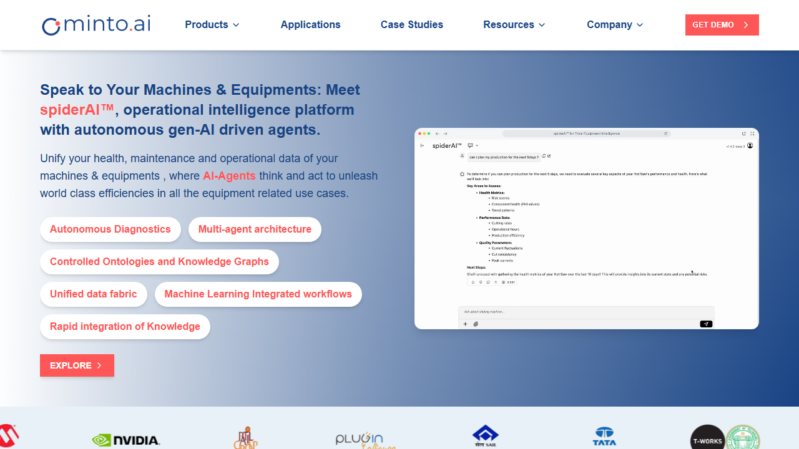 | 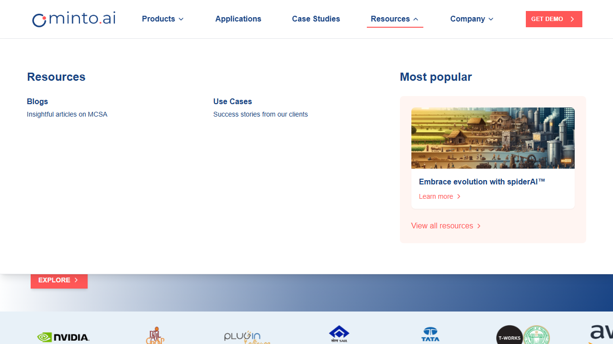 |

#### Revealed Links

- [Blogs](/blog)
- [Use Cases](/comingsoon)
- [Embrace evolution with spiderAI™

Learn more](/blog/embracing-evolution-with-spider-ai)
- [View all resources](/blog)

---

### Twitter Link

**Behavior Detected:** `dropdown`
**Scenario File:** `scenarios/Twitter_Link.feature`

```gherkin
Feature: Hover Interaction - Twitter Link
  As a user visiting the website
  I want to see dropdown content when hovering over the Twitter link
  So that I can access navigation links

  @hover @dropdown
  Scenario: Twitter link reveals dropdown on hover
    Given I am on the homepage
    When I hover over the "Twitter" link
    Then a dropdown menu should become visible
    And I should see the following links:
      | Link Text | URL |
      | Home | / |
      | spiderAI™ | /spiderai |
      | iHz™ | /ihz |
      | About | /about |
      | Blog | /blog |
      | Contact Us | /contactus |
      | Facebook | https://www.facebook.com/profile.php?id=100042907616152 |
      | Instagram | https://www.instagram.com/inside_minto.ai/ |
      | Twitter | https://x.com/mintoai_iiot?lang=en |
      | LinkedIn | https://in.linkedin.com/company/mintoai |
```

#### Screenshot Evidence

| Before Hover | After Hover |
|:------------:|:-----------:|
|  |  |

#### Revealed Links

- [Home](/)
- [spiderAI™](/spiderai)
- [iHz™](/ihz)
- [About](/about)
- [Blog](/blog)

---

## Additional Interactive Elements

These interactive hover elements were detected but don't have individual scenario files.

### Products menu item

**Behavior:** `dropdown`

| Before Hover | After Hover |
|:------------:|:-----------:|
|  |  |

#### Revealed Links

- [iHz™ - IoT system for Electrical Signature analysi](/ihz)
- [spiderAI™ - Operational intelligence platform for ](/spiderai)

---

### Resources menu item

**Behavior:** `dropdown`

| Before Hover | After Hover |
|:------------:|:-----------:|
|  |  |

#### Revealed Links

- [Blogs](/blog)
- [Use Cases](/comingsoon)
- [Embrace evolution with spiderAI™

Learn more](/blog/embracing-evolution-with-spider-ai)
- [View all resources](/blog)

---

### Company menu item

**Behavior:** `dropdown`

| Before Hover | After Hover |
|:------------:|:-----------:|
|  |  |

#### Revealed Links

- [About us](/about)
- [Careers](/careers)
- [Contact](/contactus)
- [Looking for a new career? Get in touch](/contactus)

---

### Explore All Applications button

**Behavior:** `content_revealed`

| Before Hover | After Hover |
|:------------:|:-----------:|
|  |  |

---

### Contact Us button

**Behavior:** `dropdown`

| Before Hover | After Hover |
|:------------:|:-----------:|
|  |  |

#### Revealed Links

- [Home](/)
- [spiderAI™](/spiderai)
- [iHz™](/ihz)
- [Facebook](https://www.facebook.com/profile.php?id=100042907616152)
- [Instagram](https://www.instagram.com/inside_minto.ai/)

---

### Home link

**Behavior:** `dropdown`

| Before Hover | After Hover |
|:------------:|:-----------:|
|  |  |

#### Revealed Links

- [Home](/)
- [spiderAI™](/spiderai)
- [iHz™](/ihz)
- [About](/about)
- [Blog](/blog)

---

### iHz™ link

**Behavior:** `dropdown`

| Before Hover | After Hover |
|:------------:|:-----------:|
|  |  |

#### Revealed Links

- [Home](/)
- [spiderAI™](/spiderai)
- [iHz™](/ihz)
- [About](/about)
- [Blog](/blog)

---

### About link

**Behavior:** `dropdown`

| Before Hover | After Hover |
|:------------:|:-----------:|
|  |  |

#### Revealed Links

- [Home](/)
- [spiderAI™](/spiderai)
- [iHz™](/ihz)
- [About](/about)
- [Blog](/blog)

---

### Blog link

**Behavior:** `dropdown`

| Before Hover | After Hover |
|:------------:|:-----------:|
|  |  |

#### Revealed Links

- [Home](/)
- [spiderAI™](/spiderai)
- [iHz™](/ihz)
- [About](/about)
- [Blog](/blog)

---

### Contact Us link

**Behavior:** `dropdown`

| Before Hover | After Hover |
|:------------:|:-----------:|
|  |  |

#### Revealed Links

- [Home](/)
- [spiderAI™](/spiderai)
- [iHz™](/ihz)
- [Facebook](https://www.facebook.com/profile.php?id=100042907616152)
- [Instagram](https://www.instagram.com/inside_minto.ai/)

---

### Facebook link

**Behavior:** `dropdown`

| Before Hover | After Hover |
|:------------:|:-----------:|
|  |  |

#### Revealed Links

- [Home](/)
- [spiderAI™](/spiderai)
- [iHz™](/ihz)
- [About](/about)
- [Blog](/blog)

---

### Instagram link

**Behavior:** `dropdown`

| Before Hover | After Hover |
|:------------:|:-----------:|
|  |  |

#### Revealed Links

- [Home](/)
- [spiderAI™](/spiderai)
- [iHz™](/ihz)
- [About](/about)
- [Blog](/blog)

---

### Twitter link

**Behavior:** `dropdown`

| Before Hover | After Hover |
|:------------:|:-----------:|
|  |  |

#### Revealed Links

- [Home](/)
- [spiderAI™](/spiderai)
- [iHz™](/ihz)
- [About](/about)
- [Blog](/blog)

---

### LinkedIn link

**Behavior:** `dropdown`

| Before Hover | After Hover |
|:------------:|:-----------:|
|  |  |

#### Revealed Links

- [Home](/)
- [spiderAI™](/spiderai)
- [iHz™](/ihz)
- [About](/about)
- [Blog](/blog)

---

## Summary

| Metric | Count |
|--------|-------|
| Total elements tested | 23 |
| Dropdowns detected | 13 |
| Tooltips detected | 0 |
| Content revealed | 1 |
| No change | 4 |
| Unreachable | 5 |
| Scenario files generated | 14 |

### Output Structure

```
output/084c8d35-2363-4eef-a411-940479298473/
├── hover_report.md          (this report)
├── screenshots/             (before/after images)
│   └── *.png
├── scenarios/               (individual Gherkin files)
│   └── *.feature
└── behaviors/               (hover detection data)
    └── *.json
```
