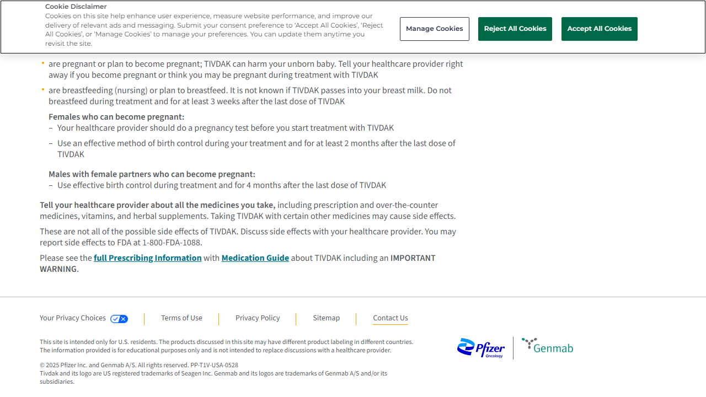
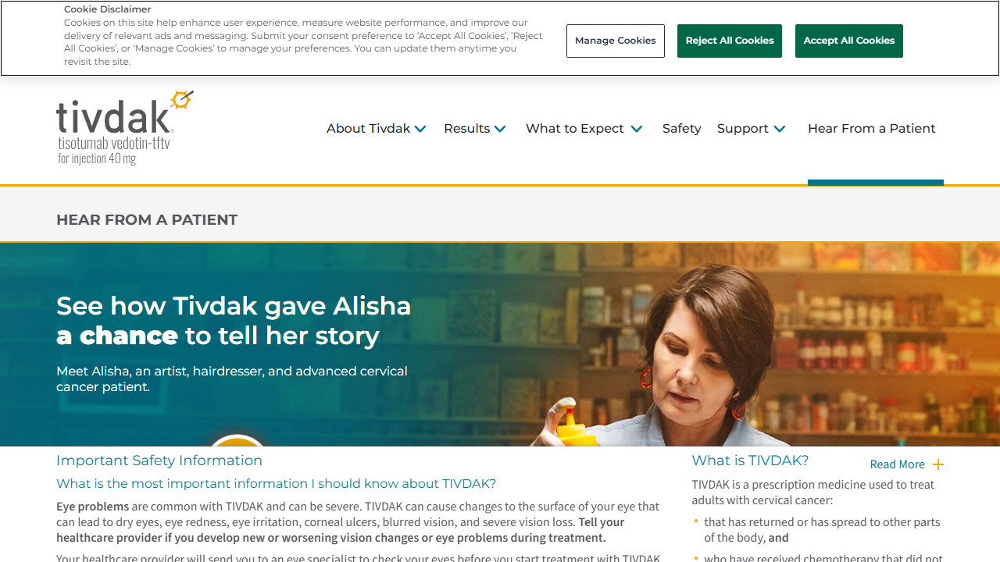

# Hover Detection Report for Tivdak.com

Generated: 2025-12-23 18:33:22
Session ID: `62be67bc-d2fa-4f24-acd1-be959f7d3c7a`

---

## TLDR - Executive Summary

**Website:** Tivdak.com
**Test Date:** 2025-12-23 18:33
**Session ID:** `62be67bc-d2fa-4f24-acd1-be959f7d3c7a`

### At a Glance

| Metric | Value |
|--------|-------|
| Total Elements Tested | 16 |
| Interactive Elements Found | 6 |
| Test Success Rate | 81.2% |
| Gherkin Scenarios Generated | 6 |

### Key Findings

**✅ Dropdowns Detected (6):**
  - **Click to expand About Tivdak menu**: reveals 2 links
  - **Your Privacy Choices link**: reveals 9 links
  - **Terms of Use link**: reveals 9 links
  - **Privacy Policy link**: reveals 9 links
  - **Sitemap link**: reveals 9 links

**ℹ️ Static Elements (7):** Elements with no hover behavior (click-only)

**ℹ️ Unreachable Elements (3):** Elements that could not be hovered (out of viewport, hidden, or dynamically loaded)
  - Click to expand Results menu
  - Click to expand What to Expect menu
  - Click to expand Support menu

### Insights

- The site has **6 interactive hover elements** that enhance user navigation
- Dropdown menus reveal a total of **47 navigation links**
- **3 elements** were unreachable (out of viewport, hidden, or dynamically loaded - this is expected for modern dynamic websites)
- **Good test coverage** - most elements were successfully tested

---

## Table of Contents

1. [TLDR - Executive Summary](#tldr---executive-summary)
2. [Test Scenarios with Evidence](#test-scenarios-with-evidence)
3. [Summary](#summary)

---

## Test Scenarios with Evidence

Each scenario includes the Gherkin specification followed by before/after screenshot comparison.

### About Tivdak Menu

**Behavior Detected:** `dropdown`
**Scenario File:** `scenarios/About_Tivdak_Menu.feature`

```gherkin
Feature: Hover Interaction - About Tivdak Menu
  As a user visiting the website
  I want to see dropdown content when hovering over the About Tivdak menu
  So that I can access information about Tivdak

  @hover @dropdown
  Scenario: About Tivdak menu reveals dropdown on hover
    Given I am on the homepage
    When I hover over the "About Tivdak" menu item
    Then a dropdown menu should become visible
    And I should see the following links:
      | Link Text | URL |
      | Tivdak and You | /about-tivdak/ |
      | What Is Tivdak? | /about-tivdak/ |
```

#### Screenshot Evidence

| Before Hover | After Hover |
|:------------:|:-----------:|
|  |  |

#### Revealed Links

- [Tivdak and You](/about-tivdak/)
- [What Is Tivdak?](/about-tivdak/)

---

### Contact Us Menu

**Behavior Detected:** `dropdown`
**Scenario File:** `scenarios/Contact_Us_Menu.feature`

```gherkin
Feature: Hover Interaction - Contact Us Menu
  As a user visiting the website
  I want to see dropdown content when hovering over the Contact Us link
  So that I can access contact information

  @hover @dropdown
  Scenario: Contact Us link reveals dropdown on hover
    Given I am on the homepage
    When I hover over the "Contact Us" link
    Then a dropdown menu should become visible
    And I should see the following links:
      | Link Text | URL |
      | 1-800-FDA-1088 | tel:1-800-332-1088 |
      | full Prescribing Information | https://labeling.pfizer.com/ShowLabeling.aspx?id=20632 |
      | Medication Guide | https://labeling.pfizer.com/ShowLabeling.aspx?id=20632&Section=MedGuide |
      | Terms of Use | https://webfiles.pfizer.com/Seagen_Terms_and_Conditions.pdf |
      | Privacy Policy | https://webfiles.pfizer.com/Seagen_Privacy_Policy.pdf |
      | Sitemap | /sitemap/ |
      | Contact Us | https://www.pfizer.com/contact |
      | | https://www.pfizer.com/ |
      | | https://www.genmab.com/ |
```

#### Screenshot Evidence

| Before Hover | After Hover |
|:------------:|:-----------:|
|  |  |

#### Revealed Links

- [1-800-FDA-1088](tel:1-800-332-1088)
- [full Prescribing Information](https://labeling.pfizer.com/ShowLabeling.aspx?id=20632)
- [Medication Guide](https://labeling.pfizer.com/ShowLabeling.aspx?id=20632&Section=MedGuide)
- [Terms of Use](https://webfiles.pfizer.com/Seagen_Terms_and_Conditions.pdf)
- [Privacy Policy](	
                            https://webfiles.pfizer.com/Seagen_Privacy_Policy.pdf)

---

### Privacy Policy Menu

**Behavior Detected:** `dropdown`
**Scenario File:** `scenarios/Privacy_Policy_Menu.feature`

```gherkin
Feature: Hover Interaction - Privacy Policy Menu
  As a user visiting the website
  I want to see dropdown content when hovering over the Privacy Policy link
  So that I can access privacy-related information

  @hover @dropdown
  Scenario: Privacy Policy link reveals dropdown on hover
    Given I am on the homepage
    When I hover over the "Privacy Policy" link
    Then a dropdown menu should become visible
    And I should see the following links:
      | Link Text | URL |
      | 1-800-FDA-1088 | tel:1-800-332-1088 |
      | full Prescribing Information | https://labeling.pfizer.com/ShowLabeling.aspx?id=20632 |
      | Medication Guide | https://labeling.pfizer.com/ShowLabeling.aspx?id=20632&Section=MedGuide |
      | Terms of Use | https://webfiles.pfizer.com/Seagen_Terms_and_Conditions.pdf |
      | Privacy Policy | https://webfiles.pfizer.com/Seagen_Privacy_Policy.pdf |
      | Sitemap | /sitemap/ |
      | Contact Us | https://www.pfizer.com/contact |
      | | https://www.pfizer.com/ |
      | | https://www.genmab.com/ |
```

#### Screenshot Evidence

| Before Hover | After Hover |
|:------------:|:-----------:|
|  |  |

#### Revealed Links

- [1-800-FDA-1088](tel:1-800-332-1088)
- [full Prescribing Information](https://labeling.pfizer.com/ShowLabeling.aspx?id=20632)
- [Medication Guide](https://labeling.pfizer.com/ShowLabeling.aspx?id=20632&Section=MedGuide)
- [Terms of Use](https://webfiles.pfizer.com/Seagen_Terms_and_Conditions.pdf)
- [Privacy Policy](	
                            https://webfiles.pfizer.com/Seagen_Privacy_Policy.pdf)

---

### Sitemap Menu

**Behavior Detected:** `dropdown`
**Scenario File:** `scenarios/Sitemap_Menu.feature`

```gherkin
Feature: Hover Interaction - Sitemap Menu
  As a user visiting the website
  I want to see dropdown content when hovering over the Sitemap link
  So that I can navigate to different sections of the site

  @hover @dropdown
  Scenario: Sitemap link reveals dropdown on hover
    Given I am on the homepage
    When I hover over the "Sitemap" link
    Then a dropdown menu should become visible
    And I should see the following links:
      | Link Text | URL |
      | 1-800-FDA-1088 | tel:1-800-332-1088 |
      | full Prescribing Information | https://labeling.pfizer.com/ShowLabeling.aspx?id=20632 |
      | Medication Guide | https://labeling.pfizer.com/ShowLabeling.aspx?id=20632&Section=MedGuide |
      | Terms of Use | https://webfiles.pfizer.com/Seagen_Terms_and_Conditions.pdf |
      | Privacy Policy | https://webfiles.pfizer.com/Seagen_Privacy_Policy.pdf |
      | Sitemap | /sitemap/ |
      | Contact Us | https://www.pfizer.com/contact |
      | | https://www.pfizer.com/ |
      | | https://www.genmab.com/ |
```

#### Screenshot Evidence

| Before Hover | After Hover |
|:------------:|:-----------:|
|  |  |

#### Revealed Links

- [Tivdak and You](/about-tivdak/)
- [What Is Tivdak?](/about-tivdak/)

---

### Terms of Use Menu

**Behavior Detected:** `dropdown`
**Scenario File:** `scenarios/Terms_of_Use_Menu.feature`

```gherkin
Feature: Hover Interaction - Terms of Use Menu
  As a user visiting the website
  I want to see dropdown content when hovering over the Terms of Use link
  So that I can access legal information

  @hover @dropdown
  Scenario: Terms of Use link reveals dropdown on hover
    Given I am on the homepage
    When I hover over the "Terms of Use" link
    Then a dropdown menu should become visible
    And I should see the following links:
      | Link Text | URL |
      | 1-800-FDA-1088 | tel:1-800-332-1088 |
      | full Prescribing Information | https://labeling.pfizer.com/ShowLabeling.aspx?id=20632 |
      | Medication Guide | https://labeling.pfizer.com/ShowLabeling.aspx?id=20632&Section=MedGuide |
      | Terms of Use | https://webfiles.pfizer.com/Seagen_Terms_and_Conditions.pdf |
      | Privacy Policy | https://webfiles.pfizer.com/Seagen_Privacy_Policy.pdf |
      | Sitemap | /sitemap/ |
      | Contact Us | https://www.pfizer.com/contact |
      | | https://www.pfizer.com/ |
      | | https://www.genmab.com/ |
```

#### Screenshot Evidence

| Before Hover | After Hover |
|:------------:|:-----------:|
|  |  |

#### Revealed Links

- [1-800-FDA-1088](tel:1-800-332-1088)
- [full Prescribing Information](https://labeling.pfizer.com/ShowLabeling.aspx?id=20632)
- [Medication Guide](https://labeling.pfizer.com/ShowLabeling.aspx?id=20632&Section=MedGuide)
- [Terms of Use](https://webfiles.pfizer.com/Seagen_Terms_and_Conditions.pdf)
- [Privacy Policy](	
                            https://webfiles.pfizer.com/Seagen_Privacy_Policy.pdf)

---

### Your Privacy Choices Menu

**Behavior Detected:** `dropdown`
**Scenario File:** `scenarios/Your_Privacy_Choices_Menu.feature`

```gherkin
Feature: Hover Interaction - Your Privacy Choices Menu
  As a user visiting the website
  I want to see dropdown content when hovering over the Your Privacy Choices link
  So that I can access privacy-related information

  @hover @dropdown
  Scenario: Your Privacy Choices link reveals dropdown on hover
    Given I am on the homepage
    When I hover over the "Your Privacy Choices" link
    Then a dropdown menu should become visible
    And I should see the following links:
      | Link Text | URL |
      | 1-800-FDA-1088 | tel:1-800-332-1088 |
      | full Prescribing Information | https://labeling.pfizer.com/ShowLabeling.aspx?id=20632 |
      | Medication Guide | https://labeling.pfizer.com/ShowLabeling.aspx?id=20632&Section=MedGuide |
      | Terms of Use | https://webfiles.pfizer.com/Seagen_Terms_and_Conditions.pdf |
      | Privacy Policy | https://webfiles.pfizer.com/Seagen_Privacy_Policy.pdf |
      | Sitemap | /sitemap/ |
      | Contact Us | https://www.pfizer.com/contact |
      | | https://www.pfizer.com/ |
      | | https://www.genmab.com/ |
```

#### Screenshot Evidence

| Before Hover | After Hover |
|:------------:|:-----------:|
|  |  |

#### Revealed Links

- [1-800-FDA-1088](tel:1-800-332-1088)
- [full Prescribing Information](https://labeling.pfizer.com/ShowLabeling.aspx?id=20632)
- [Medication Guide](https://labeling.pfizer.com/ShowLabeling.aspx?id=20632&Section=MedGuide)
- [Terms of Use](https://webfiles.pfizer.com/Seagen_Terms_and_Conditions.pdf)
- [Privacy Policy](	
                            https://webfiles.pfizer.com/Seagen_Privacy_Policy.pdf)

---

## Additional Interactive Elements

These interactive hover elements were detected but don't have individual scenario files.

### Click to expand About Tivdak menu

**Behavior:** `dropdown`

| Before Hover | After Hover |
|:------------:|:-----------:|
|  |  |

#### Revealed Links

- [Tivdak and You](/about-tivdak/)
- [What Is Tivdak?](/about-tivdak/)

---

### Your Privacy Choices link

**Behavior:** `dropdown`

| Before Hover | After Hover |
|:------------:|:-----------:|
|  |  |

#### Revealed Links

- [1-800-FDA-1088](tel:1-800-332-1088)
- [full Prescribing Information](https://labeling.pfizer.com/ShowLabeling.aspx?id=20632)
- [Medication Guide](https://labeling.pfizer.com/ShowLabeling.aspx?id=20632&Section=MedGuide)
- [Terms of Use](https://webfiles.pfizer.com/Seagen_Terms_and_Conditions.pdf)
- [Privacy Policy](	
                            https://webfiles.pfizer.com/Seagen_Privacy_Policy.pdf)

---

### Terms of Use link

**Behavior:** `dropdown`

| Before Hover | After Hover |
|:------------:|:-----------:|
|  |  |

#### Revealed Links

- [1-800-FDA-1088](tel:1-800-332-1088)
- [full Prescribing Information](https://labeling.pfizer.com/ShowLabeling.aspx?id=20632)
- [Medication Guide](https://labeling.pfizer.com/ShowLabeling.aspx?id=20632&Section=MedGuide)
- [Terms of Use](https://webfiles.pfizer.com/Seagen_Terms_and_Conditions.pdf)
- [Privacy Policy](	
                            https://webfiles.pfizer.com/Seagen_Privacy_Policy.pdf)

---

### Privacy Policy link

**Behavior:** `dropdown`

| Before Hover | After Hover |
|:------------:|:-----------:|
|  |  |

#### Revealed Links

- [1-800-FDA-1088](tel:1-800-332-1088)
- [full Prescribing Information](https://labeling.pfizer.com/ShowLabeling.aspx?id=20632)
- [Medication Guide](https://labeling.pfizer.com/ShowLabeling.aspx?id=20632&Section=MedGuide)
- [Terms of Use](https://webfiles.pfizer.com/Seagen_Terms_and_Conditions.pdf)
- [Privacy Policy](	
                            https://webfiles.pfizer.com/Seagen_Privacy_Policy.pdf)

---

### Sitemap link

**Behavior:** `dropdown`

| Before Hover | After Hover |
|:------------:|:-----------:|
|  |  |

#### Revealed Links

- [1-800-FDA-1088](tel:1-800-332-1088)
- [full Prescribing Information](https://labeling.pfizer.com/ShowLabeling.aspx?id=20632)
- [Medication Guide](https://labeling.pfizer.com/ShowLabeling.aspx?id=20632&Section=MedGuide)
- [Terms of Use](https://webfiles.pfizer.com/Seagen_Terms_and_Conditions.pdf)
- [Privacy Policy](	
                            https://webfiles.pfizer.com/Seagen_Privacy_Policy.pdf)

---

### Contact Us link

**Behavior:** `dropdown`

| Before Hover | After Hover |
|:------------:|:-----------:|
|  |  |

#### Revealed Links

- [1-800-FDA-1088](tel:1-800-332-1088)
- [full Prescribing Information](https://labeling.pfizer.com/ShowLabeling.aspx?id=20632)
- [Medication Guide](https://labeling.pfizer.com/ShowLabeling.aspx?id=20632&Section=MedGuide)
- [Terms of Use](https://webfiles.pfizer.com/Seagen_Terms_and_Conditions.pdf)
- [Privacy Policy](	
                            https://webfiles.pfizer.com/Seagen_Privacy_Policy.pdf)

---

## Summary

| Metric | Count |
|--------|-------|
| Total elements tested | 16 |
| Dropdowns detected | 6 |
| Tooltips detected | 0 |
| Content revealed | 0 |
| No change | 7 |
| Unreachable | 3 |
| Scenario files generated | 6 |

### Output Structure

```
output/62be67bc-d2fa-4f24-acd1-be959f7d3c7a/
├── hover_report.md          (this report)
├── screenshots/             (before/after images)
│   └── *.png
├── scenarios/               (individual Gherkin files)
│   └── *.feature
└── behaviors/               (hover detection data)
    └── *.json
```
